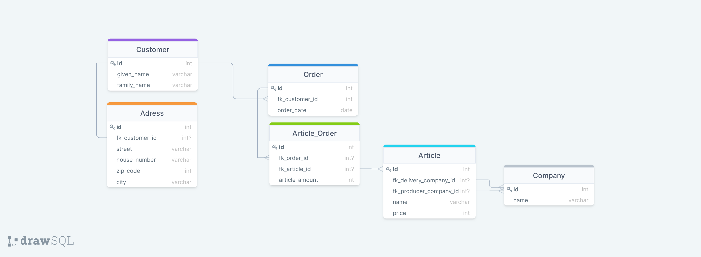

# Computershop
## 1 ER-Diagramm erstellen
Für einen Computershop soll eine Shop-Datenbank erstellt werden. Die Datenbank muss die folgenden Bedingungen erfüllen:
- Kunden können Bestellungen von einem oder mehreren Artikeln machen.
- Ein einzelner Artikel kann pro Bestellung mehrfach bestellt werden.
- Zu einem Kunden sind sein Nachname, Vorname, Strasse, Hausnummer, PLZ und Wohnort bekannt.
- Eine oder mehrere Bestellungen eines Kunden werden an einem definierten Tag gemacht.
- Jeder Artikel hat einen Lieferanten (Firmenname) und einen Hersteller (Firmenname), eine Bezeichnung und einen Preis.
- Alle Elemente (Kunden, Artikel, usw.) können erfasst sein, ohne dass sie zugeordnet sind
Zeichnen Sie für die obigen Bedingungen das ER-Diagramm, so dass die Anforderungen der 3. Normalform erfüllt sind.

### My Solution


## 2 Transformieren
Transformieren Sie das unter 1.1 erstellte ER-Diagramm in ein relationales Modell in der Form:
Tabellenname (Primärschlüssel, Feldname1, Feldname2, ...)
### Why would anyone do this?

## 3 Schematabelle der Datenbank
Erstellen Sie anhand der unter 1.2 erstellten Transformation ein tabellarisches Datenbankschema, indem Sie pro Datenbanktabelle eine Schematabelle in der folgenden Form erstellen:
### Implicitly done in 1

## 4 Create Database
Erstellen Sie einen SQL-Skript, mit dem die Datenbank «Computershop» mit allen Tabellen, Schlüsseln und Relationen erstellt werden kann.

### My Solution:
see [computershop.sql](./computershop.sql)

## 5 Mock Data
Erstellen Sie einen SQL-Skript mit dem Daten in die «Computershop»-Datenbank abgefüllt werden können.

### My Solution
Befindet sich im [MockData](./MockData) Verzeichniss, die Reihenfolge ist wichtig:
- [Company](./MockData/company.sql)
- [Article](./MockData/article.sql)
- [Customer](./MockData/customer.sql)
- [Adress](./MockData/adress.sql)
- [Order](./MockData/order.sql)
- [Article_Order](./MockData/article_order.sql)

## 6 Bestellung eines Kunden
Erstellen Sie einen SQL-Skript, mit dem alle Bestellungen eines Kunden mit allen Angaben (Kunde, Artikel, Lieferant usw.) aufgelistet werden, so dass pro Artikel einer Bestellung eine Tabellenzeile ausgegeben wird.

### My Solution
```sql
SELECT adr.city as `customer_city`,c.given_name as `customer_name`,c.family_name as `customer_family_name`, art_ord.article_amount as `ordered_amount`, com.name as `delievery_company`,comp.name as `producer_company`,art.name as `order_article`, art.price as `article_single_price` FROM `customer` as c 
JOIN `adress` as adr ON adr.fk_customer_id = c.id 
JOIN `order` as ord ON ord.fk_customer_id = c.id
JOIN `article_order` as art_ord ON art_ord.fk_order_id = ord.id
JOIN `article` as art ON art.id = art_ord.fk_article_id
JOIN `company` as com ON com.id = art.fk_delivery_company_id
JOIN `company`as comp ON comp.id = art.fk_producer_company_id
WHERE c.id = 1
```
